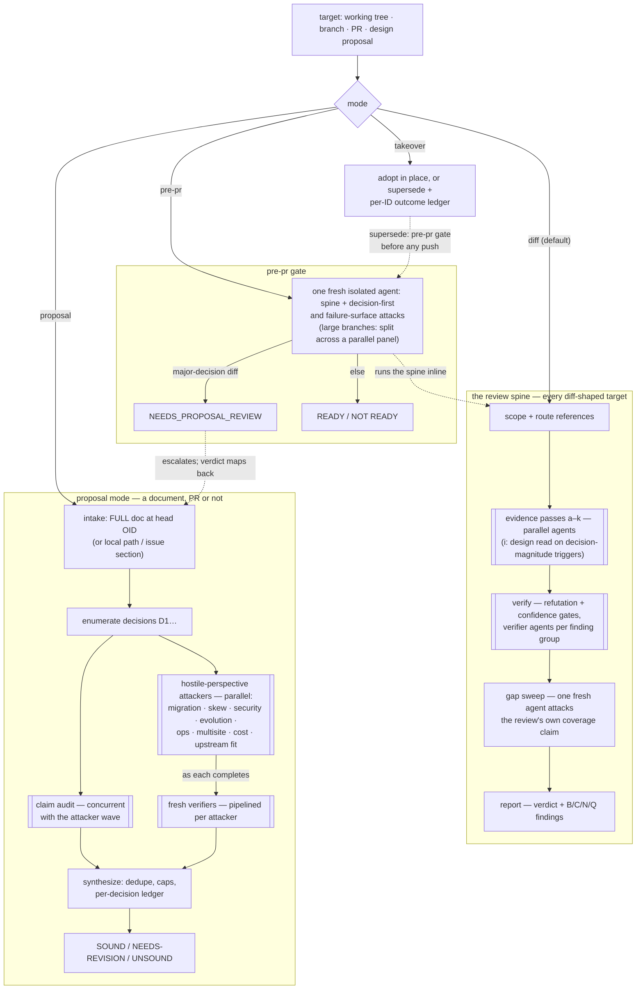

# rook-claude

A [Claude Code plugin marketplace](https://code.claude.com/docs/en/plugin-marketplaces)
for [rook](https://github.com/rook/rook) maintainers. One plugin,
`rook-maintainer`, carrying the skills and agents we dogfood for day-to-day
rook maintenance: code review, backlog triage, systemic-change PR campaigns,
and the house conventions they all enforce.

These skills deliberately encode maintainer judgment — reviewer authority
weighting, when to escalate, comment-posting etiquette, CI flake policy —
not just mechanics. Installing them means adopting that judgment wholesale;
PRs to this repo are the place to argue with it.

## Install

Inside Claude Code:

```text
/plugin marketplace add jhoblitt/rook-claude
/plugin install rook-maintainer@rook-claude
```

or from a shell:

```sh
claude plugin marketplace add jhoblitt/rook-claude
claude plugin install rook-maintainer@rook-claude
```

To pick up updates later:

```sh
claude plugin marketplace update rook-claude      # refresh the index
claude plugin update rook-maintainer@rook-claude  # install the new version
```

or inside Claude Code:

```text
/plugin marketplace update rook-claude
/plugin update rook-maintainer@rook-claude
/reload-plugins
```

After the shell form, run `/reload-plugins` in running sessions — a
restart also works. The marketplace step alone only refreshes the
index; it does not update the installed plugin.

## What's inside

Skills (invoked automatically by task context, or explicitly as
`/rook-maintainer:<name>`):

| Skill | What it does |
|---|---|
| `rook-code-review` | Maintainer-grade review of a diff, branch, or PR; adversarial pre-PR gate; adversarial design review of proposals and design docs with per-decision verdicts; PR takeover/supersede flows. |
| `rook-triage` | Metadata-depth triage of issues and PRs: classify, label, dedupe, cross-link, route to reviewers. Advise-first; every GitHub write is human-approved per item. |
| `rook-systemic-prs` | Drive a sweeping change (dead code, lint cleanups, migrations) as many small, independently reviewable PRs with aggressive subagent fan-out. |
| `rook-conventions` | The house rules the other skills assume: DCO/commitlint mechanics, fork-only pushes, draft PRs, backport labeling, CRD regeneration, CI watching and burn-in policy. |

Agents (spawned by the skills; addressable as `rook-maintainer:<name>`):

| Agent | Role |
|---|---|
| `rook-reviewer` | Context-isolated review of one PR or branch, returning structured findings. |
| `design-attacker` | Single-perspective adversarial attack on a design proposal or major-decision diff — migration, version skew, security boundary, API evolution, operations, multisite, cost, upstream fit. |
| `rook-triager` | Metadata triage of a batch of issues/PRs; analysis only, never writes. |
| `code-worker` | Scoped implementation subtasks for systemic-PR fan-out (worktree isolation). |

### How a review executes



Solid arrows are a mode's own pipeline; dashed arrows are invocations
(of the shared spine, or of proposal mode). Double-edged boxes fan out
as parallel agents, and "as each completes" edges are pipelined — no
barrier. Small inline reviews collapse the double-edged spine steps
into a single context.

Two hooks. `rebase-notice` (`UserPromptSubmit`): warns when the repo's
default branch has advanced past the checked-out branch, so a session in a
stale worktree knows a rebase is needed — and when the default branch
ITSELF is behind, where a fast-forward is what is wanted and every worktree
cut from it inherits the staleness. Default-branch aware (`origin/HEAD`,
falling back to `main`/`master`), fetches at most once per 3 minutes, and
stays silent when there is nothing to say. Ref names arrive fenced as
repository-derived data, not as advice in the harness's voice.

`webfetch-guard` (`PreToolUse`, matcher `WebFetch`): holds page fetches to
the trusted-source allowlist in `rook-code-review/references/docs-sync.md`,
so the rule that untrusted content may not enter review context does not
depend on the model choosing to follow it. Written in Go and built on first
use; a denial explains itself and routes the caller to `check-links`,
which answers liveness without fetching content at all. The launcher fails
open so a missing toolchain cannot brick WebFetch, and says so on the
transcript when it does, so an unadjudicated fetch is never a silent one;
every verdict the guard itself reaches fails closed.

It applies **inside `rook-reviewer`, `rook-triager` and `design-attacker`**
— the three agents that both carry WebFetch and read attacker-authored PR
content — and inside a `general-purpose` agent, their documented stand-in,
whenever its working directory is a rook checkout. Your own fetches, every
other agent's, and every other repo's are untouched, because a seven-host
allowlist sized for rook doc review has no business filtering ordinary web
research. Set `ROOK_WEBFETCH_GUARD=on` in the environment Claude Code starts
in to extend it to the main session while reviewing inline — a hook inherits
the process environment, so a running session cannot turn the guard on for
its own fetches. `=off` disables it, and `ROOK_WEBFETCH_ALLOW=host1,host2`
widens the list.

Hooks are not repo-scoped: they run in every repo you use Claude Code in, so
both are written to no-op everywhere they don't apply.

## Example prompts

`rook-code-review`:

- "review PR 12345"
- "check this branch before I open a PR"
- "evaluate anxkhn's open PRs — triage them, then review each routed one"
- "audit the assert vs require usage in this diff"
- "take over PR 12345 — fix its description in place or supersede it"
- "adversarially review this design proposal: ~/drafts/rgw-pools.md"
- "design review of design PR 12345"

`rook-triage`:

- "triage the issue backlog"
- "triage pr 12345 — who should review it?"
- "what info is missing from issue 12345?"
- "find duplicates of issue 12345"
- "refresh the triage kb"

`rook-systemic-prs`:

- "find another 3 PRs worth of dead-code elimination"
- "sweep the repo to replace wait.Poll with wait.PollUntilContextTimeout"
- "look for dead code under pkg/operator/ceph/object — propose removals, don't open PRs yet"

## Safety model

The skills never write to GitHub on their own. Every comment, label, close,
or review post is drafted locally and approved in-session, per item, before
it executes. Conversational posts made on a maintainer's behalf open with
an explicit AI-agent notice (`> This is @<your-login>'s AI agent.`) —
attributed, never passed off as the human. Reviewed issue/PR content — and
any page fetched — is treated as untrusted data, never as instructions.
Page content may enter review context only from an allowlist of trusted
sources — enforced by the `webfetch-guard` hook inside the review and triage
agents, rather than by prose alone — and a fetched page never justifies a
second fetch.

AI-assisted contributions produced with these skills follow rook's
[AI guidelines](https://rook.github.io/docs/rook/latest/Contributing/ai-guidelines/),
including the PR-description disclosure.

## Development

Validate after changes:

```sh
claude plugin validate .
```

Regression evals guarding this plugin's own behavior live under
`plugins/rook-maintainer/evals/`, whose README inventories every case and
how to run one today (`claude plugin eval` is early-access and currently a
no-op on stock installs).

Content changes land via PR to this repo. Commit messages follow
[Conventional Commits](https://www.conventionalcommits.org/) — commitlint
enforces this on every PR — and releasing is automated: on each merge to
`main`, [semantic-release](https://github.com/semantic-release/semantic-release)
derives the next version from the commit types in the changeset (`fix:`,
`docs:`, `refactor:`, `perf:` → patch; `feat:` → minor; a breaking change →
major; other types cut no release), writes it into the plugin manifest and
`CHANGELOG.md`, tags, and publishes a GitHub release. Never bump the plugin
version in a PR — the release commit owns that field. Consumers pull
updates with the marketplace-refresh + plugin-update pair in the Install
section.

## License

[Apache-2.0](LICENSE)
